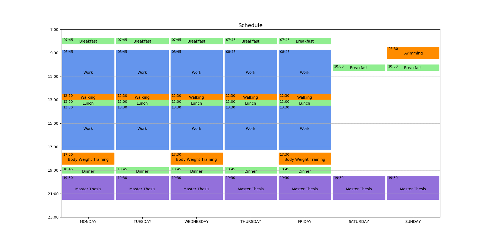

# Weekplot
This is a fork of [weekplot](https://github.com/utkuufuk/weekplot) by [utkuufuk](https://github.com/utkuufuk).
I liked how the schedules looked, but wanted to make it into an installable package and support yaml files instead of the custom event format in the original.  
The old format is however still supported in this fork.

Reads & plots your weekly schedule from a text file.



## Install
``` sh
$ git clone https://github.com/buckley-w-david/weekplot
$ pip install .
```

I recommend using [pipsi](https://github.com/mitsuhiko/pipsi) to install the package to get around polluting your system python installationg with it's dependencies.

## Usage
``` sh
$ weekplot schedule.png examples/events.txt
```

Here's an [example input file.](examples/events.txt)

## Colors
You can use the following colors in your input file:


